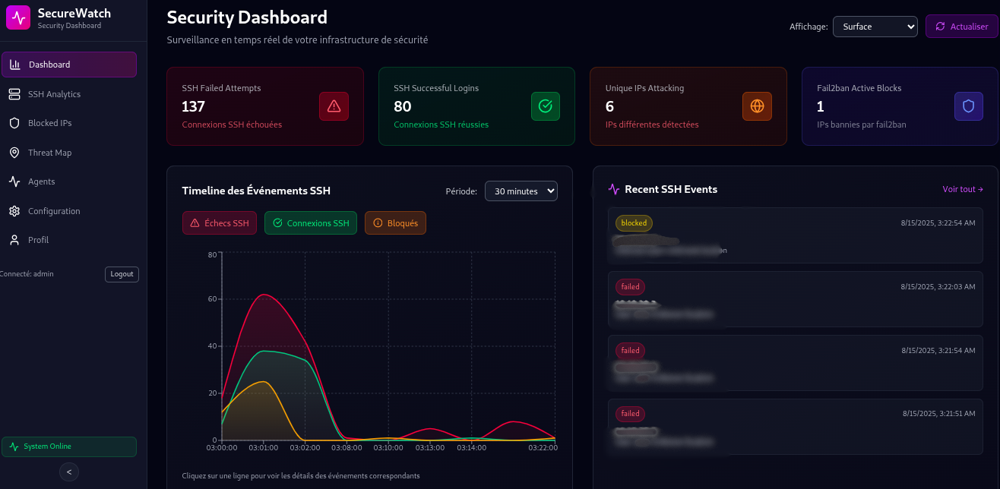
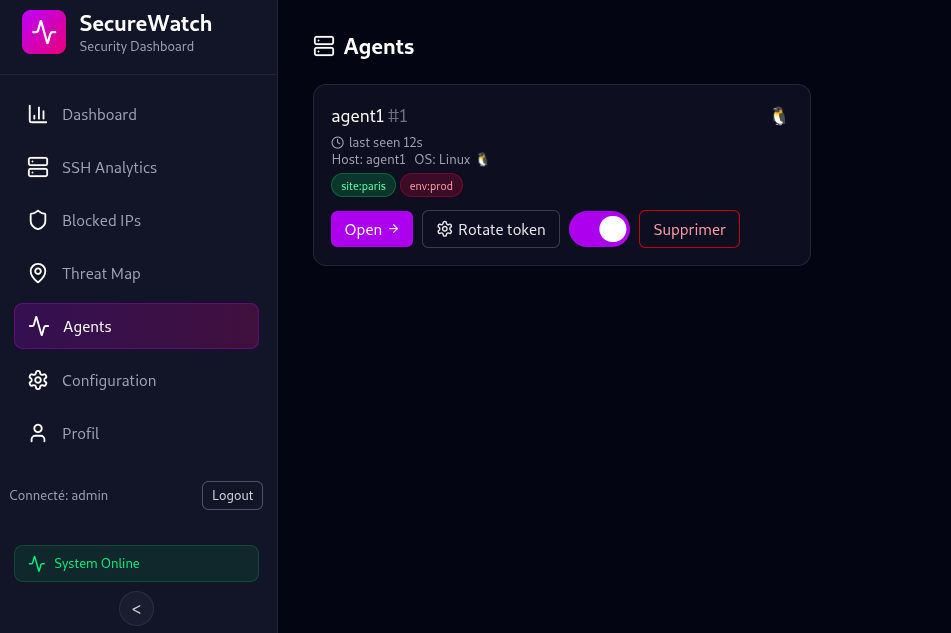
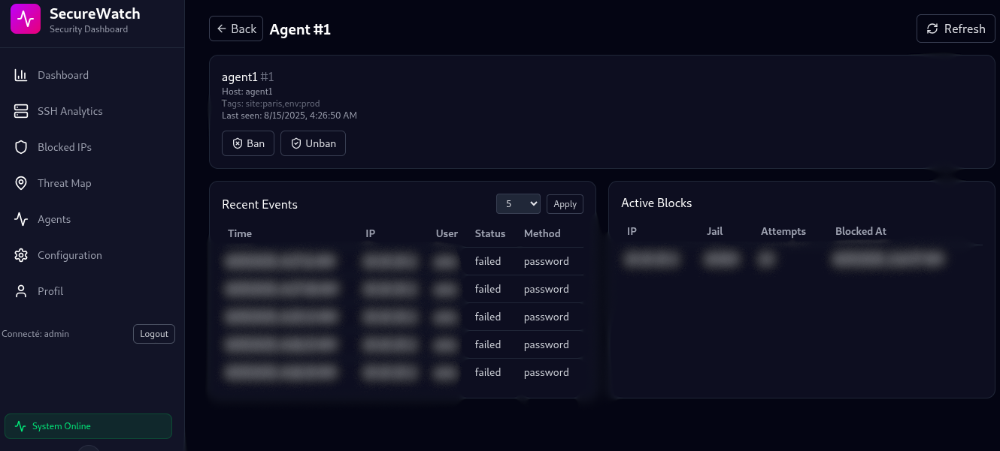

# SecureWatch



## Présentation

**SecureWatch** est une application que j’ai développée pour offrir une vue centralisée et intuitive de l’état de sécurité d’un serveur. Elle permet de surveiller en temps réel les connexions SSH, de lister les adresses IP bloquées par fail2ban, et de visualiser les menaces sur une carte interactive. Son objectif est de fournir aux administrateurs système un outil clair, rapide et efficace pour détecter les comportements suspects et renforcer la sécurité de leurs infrastructures.

## Architecture technique

- **SecureWatch** repose sur une stack moderne et légère :
- **Backend** : Node.js et SQLite
- **Frontend** : React avec Vite
- **Serveur web** : Nginx
- **Conteneurisation** : Docker + Docker Compose

## Fonctionnalités principales

- **Dashboard** : stats SSH, IP bloquées, chart, carte geo des tops attack par pays, événements récents.
- **Carte des menaces** : géolocalisation des IP malveillantes.
- **Gestion des IP** : bannissement/débannissement automatique et manuel.
- **Notifications** : envoi de  vers discord et slack.
- **Exports** : CSV et PDF des logs ssh et ip bloquées.
- **Fail2ban** : lecture/modification des fichiers de config, reload intégré.
- **Sécurité** : authentification JWT, admin par défaut au premier démarrage.
- **Agent** : collecte des événements SSH et synchronisation fail2ban avec le serveur.

## Installation rapide

### 1. Prérequis

- Docker + Docker Compose
- fail2ban et iptables installé et actif
- Accès aux fichiers suivants sur l’hôte :
  - `/var/log/auth.log`
  - `/var/log/fail2ban.log`
  - `/etc/fail2ban/{jail.d,filter.d,fail2ban.d,action.d}`

### 2. Mise en place

```bash
sudo apt update
sudo apt install -y docker.io docker-compose-plugin fail2ban iptables
sudo systemctl enable --now docker
sudo usermod -aG docker "$USER"
```

Reconnectez-vous pour que les droits Docker soient pris en compte.


```bash
sudo cp jail-sshd.conf /etc/fail2ban/jail.d/jail-sshd,conf
```

Si un jail `sshd` est déjà défini ailleurs, désactivez-le pour que `jail-sshd.conf` soit pris en compte.

Redémarrez le service :  
```bash
sudo systemctl restart fail2ban
```

### 3. Configuration

- Copiez `.env.example` en `.env`

Le `.env` vous permet de configurer les secrets de sécurité, la connexion avec les agents, et les intégrations externes (discord, slack, géolocalisation), ainsi que les paramètres de cache et de protection contre le brute-force.

- Modifiez les secrets :
  ```env
  JWT_SECRET=<change_me_min_32_chara>
  # secret doit corresspondre au meme secret que l'agent 
  AGENT_REGISTRATION_SECRET=<change_me_agent_secret_key>
  ```

### 4. Lancement

```bash
docker compose up -d
```

### 5. Accès

- Frontend : [http://localhost:5173](http://localhost:5173)
- Admin par défaut : `admin / admin` (à changer au premier login)
- API backend : [http://localhost:8787/api/health](http://localhost:8787/api/health)


#### Commandes utiles

```bash
docker compose logs -f backend   # Voir les logs
docker compose down              # Arrêter l’app
docker compose up -d            # Démarrer en arrière-plan
```

---

# SecureWatch Agent (machines clientes)



L’agent embarque un script Python qui surveille en continu les logs, formate les événements et les transmet au serveur via requests.

#### 1. Prérequis

- Docker et Docker Compose installés  
- fail2ban et iptables installés et actifs  
- Accès en lecture aux fichiers hôtes :  
  - `/var/log/auth.log`  
  - `/var/log/fail2ban.log`  
  - `/etc/fail2ban/{jail.d,filter.d,fail2ban.d,action.d}`  

#### 2. Installation et configuration

1. Copiez `.env.example-client` en `.env`.  
2. Dans `.env`, définissez :  
   - `SW_SERVER_URL=http://<IP_BACKEND>:8787`  
   - `SW_REGISTRATION_SECRET=<votre_secret_agent>`  
3. Vérifiez que `AGENT_REGISTRATION_SECRET` défini côté serveur correspond bien à `SW_REGISTRATION_SECRET` côté client. dans le .env

#### 3. Configuration de fail2ban

- Copiez `jail-sshd.conf` du projet vers `/etc/fail2ban/jail.d/`  
- Redémarrez le service :  
  ```bash
  sudo systemctl restart fail2ban
  ```

#### 4. Démarrage de l’agent

Dans le dossier contenant `docker-compose.agent.yml` et le `.env` :

```bash
docker compose up -d
```

L’agent se connecte automatiquement au serveur et apparaît dans l’interface SecureWatch.

#### 5. Gestion et suppression

- Pour retirer un agent à tout moment, stoppez ou supprimez son container et/ou son token d’enregistrement depuis l’UI.  
- Vous pourrez bannir et débannir les IP de ce client directement depuis le tableau de bord et suivre ses événements SSH en temps réel.

